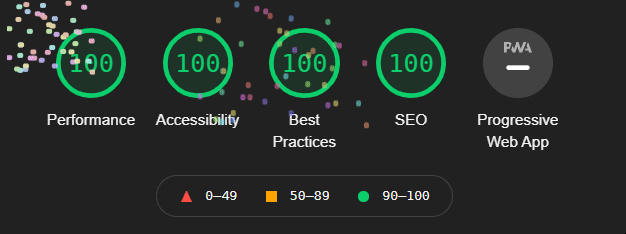

<p align="center">
   
</p>
 
<h1 align="center">danielagiorgio.com</h1>

<p align="center">	
   <a href="https://linkedin.com/in/danielagiorgio">
      
   </a>
  <a href="https://github.com/voirs/portfoliov2#readme">
    
  </a>
  <a href="https://github.com/voirs/portfoliov2/graphs/commit-activity">
    
  </a>
  <a href="https://github.com/voirs/portfoliov2/blob/master/LICENSE">
    
  </a>
  
  
  
</p>

 <p align="center">Second iteration of my web portfolio. Made with Next.js, GraphCMS, TailwindCSS and Vercel.</p>

<div align="center">
  <sub>Portfolio v2. Built by
    <a href="https://github.com/voirs">Daniela Giorgio</a>
  </sub>
</div>

<br />

---

# :pushpin: Table of Contents

* [Demo](#sparkles-demo)
* [Technologies](#computer-technologies)
* [Features](#rocket-features)
* [How to run](#construction_worker_woman-how-to-run)
* [Found a bug? Missing a specific feature?](#bug-issues)
* [Contributing](#handshake-contributing)
* [License](#closed_book-license)

# :sparkles: Demo
https://danielagiorgio.com/

# :computer: Technologies

* [Next.js](https://nextjs.org/)     
* [TailwindCSS](https://tailwindcss.com)      
* [GraphCMS](https://graphcms.com/)    
* [Vercel](https://vercel.com/)     

# :rocket: Features

- Blog page
- Search posts
- Projects page
- Dark & light theme

### Lighthouse Performance Audit


(If you run the audit, do it on incognito without any ad blocker extensions).
  
# :construction_worker_woman: How to run

You need to install [Node.js](https://nodejs.org/en/download/). Then you may choose between:

* npm 
  ```sh
  npm i npm@latest -g
  ```
  or...


* yarn
  ```sh
  npm i -g yarn
  ```

### Clone Repo
```bash
git clone https://github.com/voirs/portfoliov2.git
```
### Rename env file
Rename `.env-example` to `.env` and add a `GRAPHQL_URL_ENDPOINT`
### Install Dependencies
```bash
yarn
```
### Run Aplication
```bash 
yarn dev 
```

Open [http://localhost:3000](http://localhost:3000) with your browser to see the result.
<br>

# :bug: Issues


Contributions, issues and feature requests are welcome. I always appreciate feedback! <br />
Feel free to check [issues page](https://github.com/voirs/portfoliov2/issues) if you want to contribute.<br />


# :handshake: Contributing
First of all, thank you for being interested in helping out, your time is always appreciated in every way. 

Here's some tips:

* Check the [issues page](https://github.com/voirs/portfoliov2/issues) for already opened issues (or maybe even closed ones) that might already address your question/bug/feature request.
* Feature requests are welcomed! Provide some details on why it would be helpful for you and others, explain how you're using bull-board and if possible even some screenshots if you are willing to mock something!


# :closed_book: License

Copyright © 2021 [Daniela Giorgio](https://github.com/voirs).<br />
This repo is [MIT](https://github.com/voirs/portfolio/blob/main/LICENSE) licensed.


[⬆ Back to Top](#pushpin-table-of-contents)
